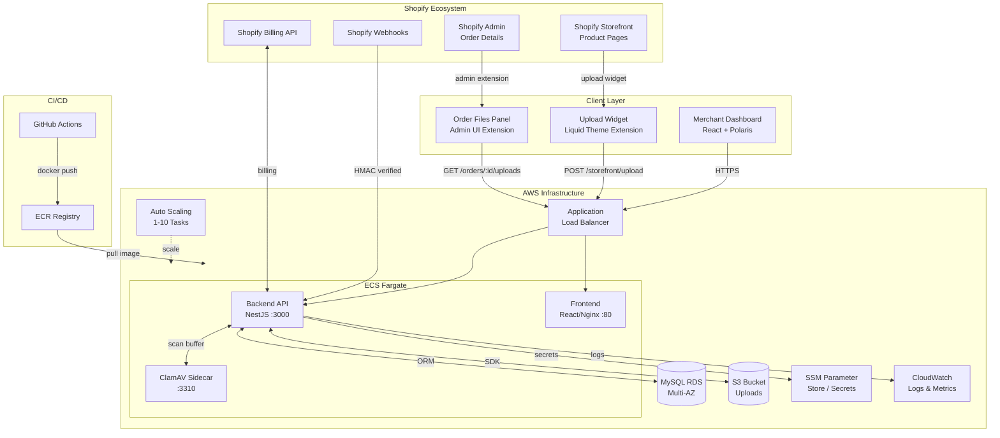
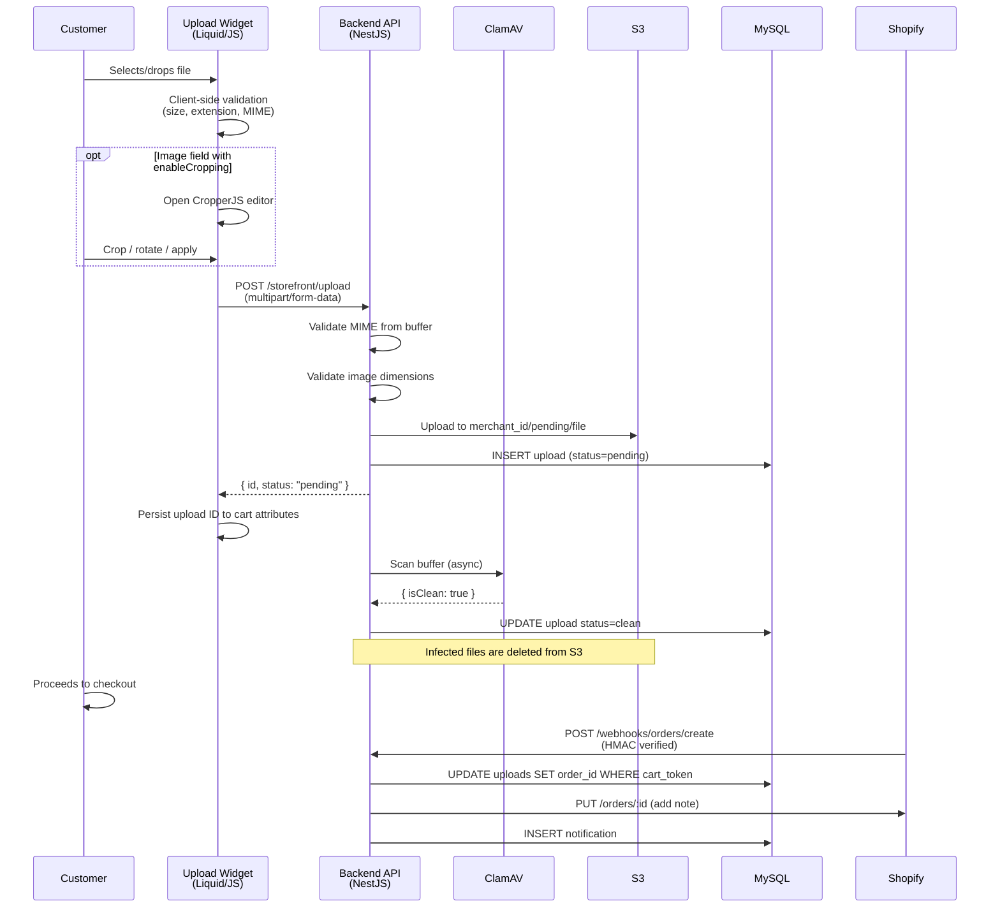
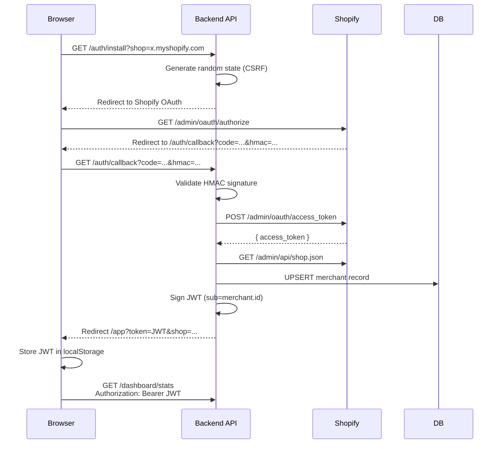

# System Architecture Diagram

## High-Level Architecture

```mermaid
graph TB
    subgraph Shopify["Shopify Ecosystem"]
        S1[Shopify Storefront<br/>Product Pages]
        S2[Shopify Admin<br/>Order Details]
        S3[Shopify Webhooks]
        S4[Shopify Billing API]
    end

    subgraph Client["Client Layer"]
        C1[Merchant Dashboard<br/>React + Polaris]
        C2[Upload Widget<br/>Liquid Theme Extension]
        C3[Order Files Panel<br/>Admin UI Extension]
    end

    subgraph AWS["AWS Infrastructure"]
        subgraph ECS["ECS Fargate"]
            B1[Backend API<br/>NestJS :3000]
            B2[Frontend<br/>React/Nginx :80]
            B3[ClamAV Sidecar<br/>:3310]
        end
        ALB[Application<br/>Load Balancer]
        RDS[(MySQL RDS<br/>Multi-AZ)]
        S3B[(S3 Bucket<br/>Uploads)]
        SSM[SSM Parameter<br/>Store / Secrets]
        CW[CloudWatch<br/>Logs & Metrics]
        AUTO[Auto Scaling<br/>1-10 Tasks]
    end

    subgraph CI["CI/CD"]
        GH[GitHub Actions]
        ECR[ECR Registry]
    end

    %% Connections
    S1 -->|upload widget| C2
    S2 -->|admin extension| C3
    C1 -->|HTTPS| ALB
    C2 -->|POST /storefront/upload| ALB
    C3 -->|GET /orders/:id/uploads| ALB
    ALB --> B1
    ALB --> B2
    B1 <-->|ORM| RDS
    B1 <-->|SDK| S3B
    B1 <-->|scan buffer| B3
    B1 -->|secrets| SSM
    B1 -->|logs| CW
    S3 -->|HMAC verified| B1
    S4 <-->|billing| B1
    GH -->|docker push| ECR
    ECR -->|pull image| ECS
    AUTO -.->|scale| ECS
```

## Request Flow: Customer File Upload

```mermaid
sequenceDiagram
    participant Customer
    participant Widget as Upload Widget<br/>(Liquid/JS)
    participant API as Backend API<br/>(NestJS)
    participant ClamAV
    participant S3
    participant DB as MySQL

    Customer->>Widget: Selects/drops file
    Widget->>Widget: Client-side validation<br/>(size, extension, MIME)
    opt Image field with enableCropping
        Widget->>Widget: Open CropperJS editor
        Customer->>Widget: Crop / rotate / apply
    end
    Widget->>API: POST /storefront/upload<br/>(multipart/form-data)
    API->>API: Validate MIME from buffer
    API->>API: Validate image dimensions
    API->>S3: Upload to merchant_id/pending/file
    API->>DB: INSERT upload (status=pending)
    API-->>Widget: { id, status: "pending" }
    Widget->>Widget: Persist upload ID to cart attributes
    API->>ClamAV: Scan buffer (async)
    ClamAV-->>API: { isClean: true }
    API->>DB: UPDATE upload status=clean
    Note over API,S3: Infected files are deleted from S3

    Customer->>Customer: Proceeds to checkout

    Shopify->>API: POST /webhooks/orders/create<br/>(HMAC verified)
    API->>DB: UPDATE uploads SET order_id WHERE cart_token
    API->>Shopify: PUT /orders/:id (add note)
    API->>DB: INSERT notification
```

## Authentication Flow

```mermaid
sequenceDiagram
    participant Browser
    participant API as Backend API
    participant Shopify

    Browser->>API: GET /auth/install?shop=x.myshopify.com
    API->>API: Generate random state (CSRF)
    API-->>Browser: Redirect to Shopify OAuth
    Browser->>Shopify: GET /admin/oauth/authorize
    Shopify-->>Browser: Redirect to /auth/callback?code=...&hmac=...
    Browser->>API: GET /auth/callback?code=...&hmac=...
    API->>API: Validate HMAC signature
    API->>Shopify: POST /admin/oauth/access_token
    Shopify-->>API: { access_token }
    API->>Shopify: GET /admin/api/shop.json
    API->>DB: UPSERT merchant record
    API->>API: Sign JWT (sub=merchant.id)
    API-->>Browser: Redirect /app?token=JWT&shop=...
    Browser->>Browser: Store JWT in localStorage
    Browser->>API: GET /dashboard/stats<br/>Authorization: Bearer JWT
```
